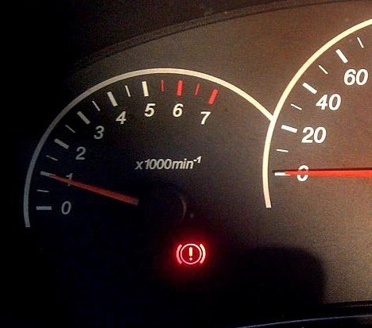
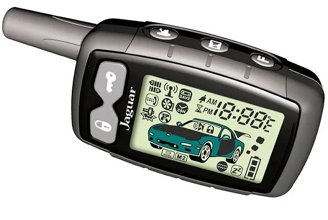

import { FileWarning } from 'lucide-react'

    <FileWarning size={32} />
    Это архивная запись, многая информация могла устареть

Дело все началось ещё в середине лета, заметил что машина перестала вставать в режим автозапуска.

Кстати сигналка у меня Jaguar EZ TWO.

#### Что вообще должно происходить?
1. При запущенном моторе ставим машину на ручник (мы должны увидеть лампочку на приборке)!

2. Нажимаем на брелке кнопку ключа

4. Брелок спиликает и машина начнет процедуру постановки на авто запуск
5. Вытаскиваем ключ и выходим из машины
6. Закрывая дверь машина должна заглушить мотор и заблокировать двери.

Но как бы не так! Машина продолжает работать и только через время глушит мотор по причине истечении времени на постановку.

#### Делать нечего, скоро зима, решаем
Начал рыть интернет, люди давали разные советы, кто-то говорил что нужно просто заменить брелок (что вообще бред ибо он работает исправно), осмотреть цепь от сигнала паркинга до блока сигнализации (тут нужно пояснить, если машина начинает процедуру постановки, то сигнал есть и проблема не в этом) и то что мне помогло: `осмотреть цепь от блока комфорта до блока сигнализации`.

#### Вот оно?
Полез разбирать все что находится под приборной, ужаса я там увидел просто тьма, но самое интересное что коса была скручена изолентой вместе с самим мотком изоленты...
(Ссори фотки нет)

По итогу я нашел оборванный провод который уже довольно сильно сгнил, починил его и о чудо теперь я не буду мерзнуть стоя у машины зимой! 🥲
