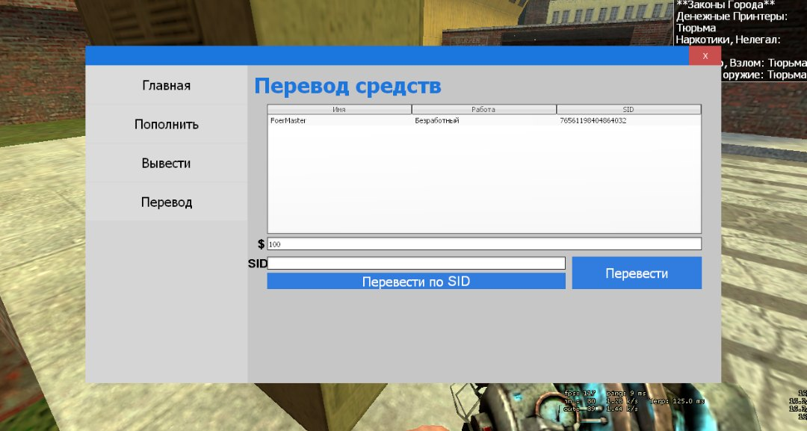
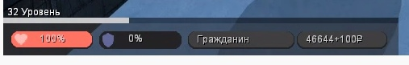
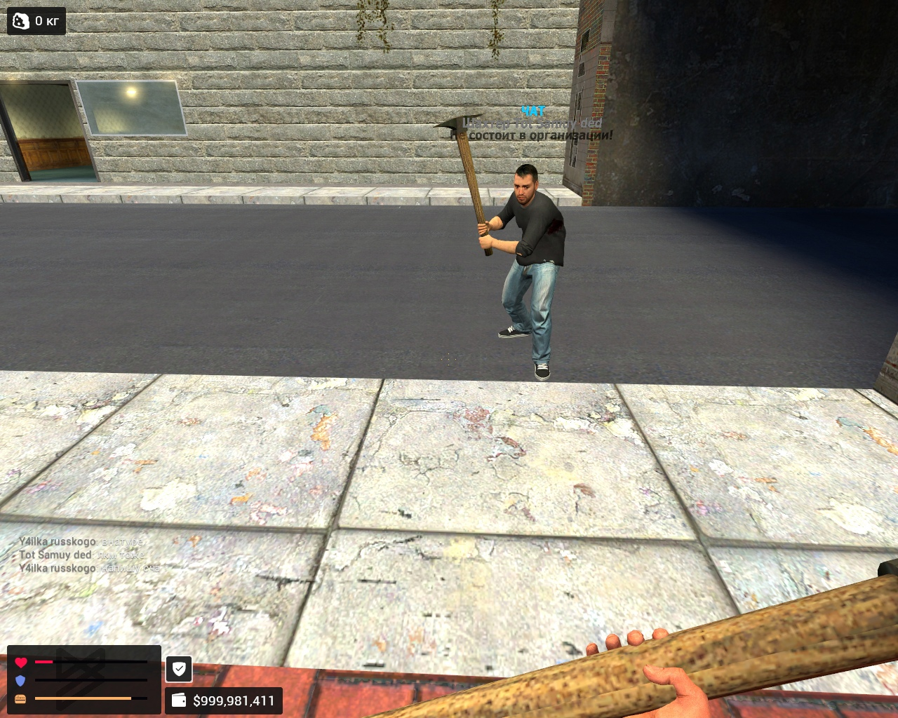
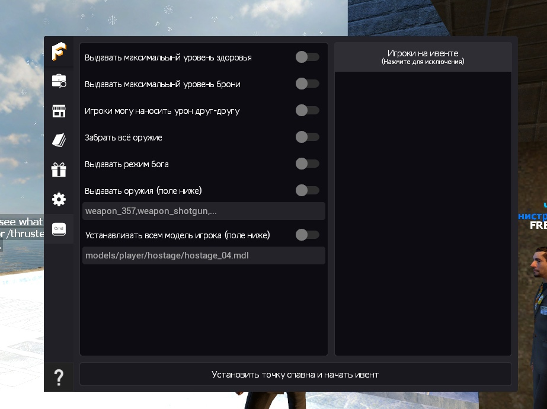
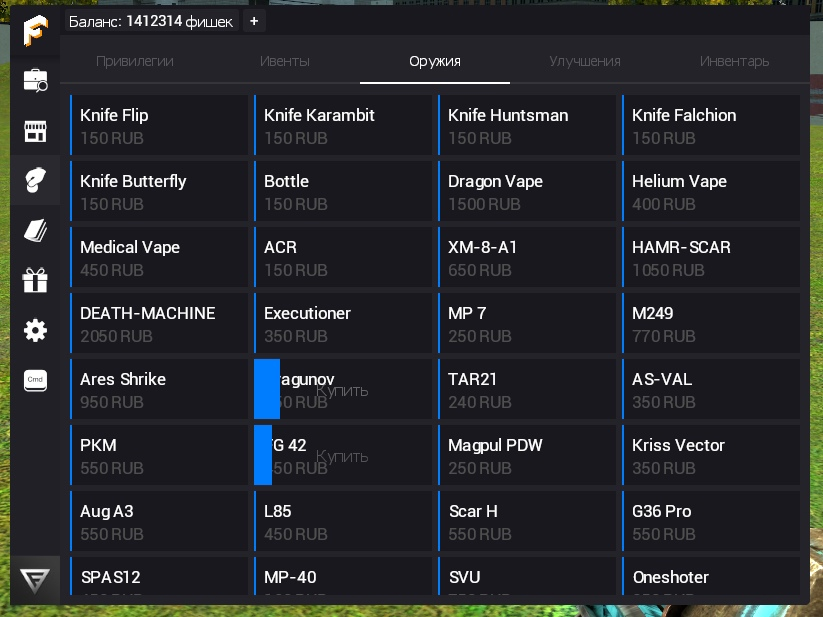

import { FileWarning } from 'lucide-react'

    <FileWarning size={32} />
    Это архивная запись, многая информация могла устареть

Крайне давно я занимался серверами по Garry's Mod, пытался сделать что-то своё, крутое, думая что все поддержат меня в этом, но увы, реальность оказалась против этого)

### 2016 год
Я зеленый и уверенный в себе, начал изучать азы gLua без знаний вообще чего-либо, нашел пару туториалов на ютубе о том как что-то принтить в консольку и запускать скрипты из папки `lua/`.

После пары неудач, я смог сделать что-то интересное: автоматическое сообщение в чат которое отправлялось раз в 10 секунд!

В тот момент я уже представлял что сделаю очень крутой сервер, с сотнями игроков которые будут ждать свободного слота))

Начало положено...

### 2017 год (первый сервер)
На тот момент, были популярны готовые сервера, очень много овнеров, тупо качали открытые сборки и ставили их к себе на сервер, ну а я что? тоже взял да скачал сборку...

Оставалась одна проблема: как же мне сделать так чтобы на мой сервер могли зайти другие игроки?, а то в локалке не очень интересно сидеть и ждать кого-либо)

#### Мой первый опыт в покупке VDS и первый запуск сервера
В 2017 году я не знал про MyArena и прочие направленные хостинги для игровых серверов, все что я знал, это то что можно запустить сервер открыв .bat/.sh скрипт. Начал рыть сеть...

Первый кто попался это firstvds, довольно дешевые сервера, а по характеристикам мне было плевать, главное чтобы запускался сервер и на него можно было зайти.

Купил самый дешевый тариф, на тот момент он стоил 800 рублей закинул деньги на киви, оплатил и начал загружать сборку на хост, с горем пополам разобрался как запустить сервер так чтобы при закрытии ssh сессии сервер не отключался (спасибо моему другу).

С дрожащими руками начал вводить в консоль игры заветную команду `connect 31.220.117.204` нажимаю Enter... иииииииии ничего... Просто не могу зайти, долго решал проблему. Оказалось что по стандарту IPTables блочил вообще все входящие подключения с протоколом UDP, хм странно, исправил, снова ввожу команду, захожу и понимаю. ЧЕРТ ВОЗЬМИ КАК ЖЕ Я КРУТ!!!, свой сервер, буду звать друзей с других серверов и играть с ними в своё удовольствие.

#### Не все так просто))))

Не долго длилось моё счастье... Никто не хотел идти ко мне на сервер, ибо многие уже усиделись на старых проектах, первым делом что я решил делать, это предлагать перенести весь прогресс со старого сервера на мой и даже больше. Это помогло, люди начали заходить на сервер, все шло гладко ровно неделю... Вы же помните, что ранее я упомянул что это скачанная сборка из интернета?, тогда-то я узнал что такое бэкдор))). Да обидно, да страшно, но уже с этим ничего не сделать. Грустный закрыл сервер и забил на разработку серверов еще на год.

### 2018 - 2020 год
Эти времена я старался делать свои аддоны, параллельно пытаясь возродить свой сервер, но увы сервер я возродить не смог.

а вот пара скриншотов моего первого аддона на банк) (прости amd, мне понравилась твоя система, хотел сделать подобную)

Первый худ

### 2021 год, переворот.
Уже зная много всяких плюшек, я начинаю делать очень серьёзный проект DarkRP, максимально смотря в каждые детали сервера. Задача стояла в том чтобы сделать интересный и не душный сервер.

Тогда-то зародился FreshRP, сервер который стрельнул но помер из-за ошибки хостинг-провайдера (вот тут внимание я не помню какой именно был хостинг, но в тот момент я использовал ноунем хост).

Система ивентов

И оаоаоао собственный авто-донат

первые баги)))

### Конец
А почему собственно помер?
А все просто у хостинга слетели винты и файлы проекта просто сгинули, а гитом я не любил тогда пользоваться)

