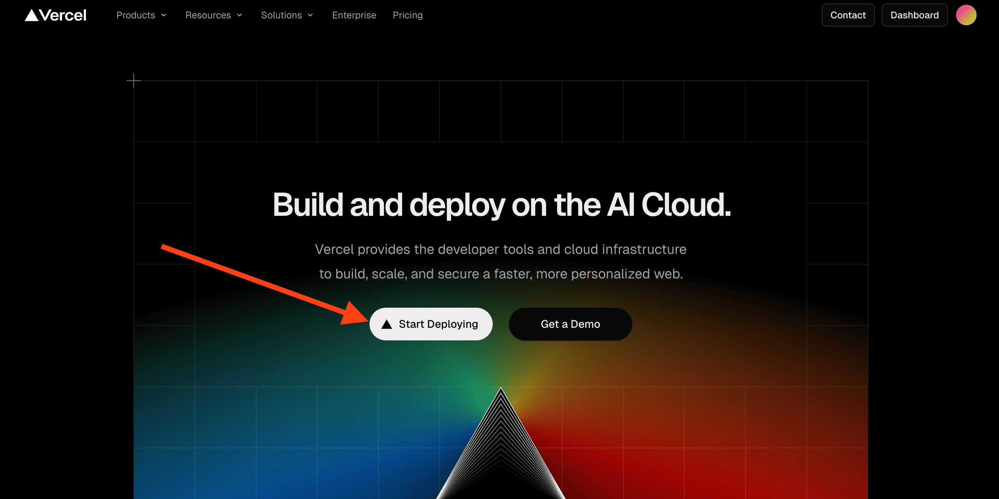

import {FileWarning} from "lucide-react"

    <FileWarning size={32} />
    Вероятно я перепишу эту страницу, ибо я только учусь излагать свои мысли текстом.

Возможно, уже многие знают про такие штуки, как [Vercel](https://vercel.com/) и [GitHub Pages](https://pages.github.com/). Если вам уже известно, что это такое и как с этим работать, то увы, ничего нового я вам не поведаю 😔. Но если вы не в курсе, то вот инструкция, как захостить свой сайт:

## Зачем оно вам и будет ли это работать

В первую очередь нужно понять, какой сайт вы хотите захостить. Если это интернет-магазин или какой-то другой подобный **большой сайт со сложной "подкапотной" логикой на стороне сервера, или планируются большие нагрузки, то увы — это не для вас**. Но могу порекомендовать от себя хостинг [TimeWeb Cloud](https://timeweb.cloud/) (не реклама). На нём удобно хостить приложения или сайты с обновлением по коммиту из гита.

## Деплой

### Vercel

Тут всё очень просто: заходим в свой аккаунт или регистрируемся на сервисе, тыкаем привязку Git, выдаём права на все или только необходимый репозиторий из Git'а, нажимаем "Import", заполняем всю информацию о том, как деплоить ваше чудо, и всё. Ждём сборки, указываем домен (вероятно, у вас будет вида `example.vercel.app`) - и готово!

#### Дополнительно: Свой домен.
Около "Domains" тыкаем плюсик, далее нажимаем "Add domain". Потом нужно выбрать, к какому проекту будем подключать домен или куда будем переадресовывать. После этого сохраняем, и нам напишут инструкции, куда и что прописать в DNS-записях вашего домена.
